# 📘 مشروع مدونة شخصية بـ Django / Personal Blog Project with Django
## كيفية تشغيل المشروع 
###  pip install -r requirements.txt

###  python manage.py migrate

###  python manage.py runserver


## 🇸🇦 بالعربية

### 💡 عن المشروع
هذا المشروع هو مدونة شخصية بسيطة مبنية باستخدام إطار عمل Django، وتم دمجها مع قالب مجاني أنيق يدعى **Calvin** من تصميم StyleShout. 
الهدف من المشروع هو التعلم، التجربة، أو تقديمه كمثال مرجعي لمطوري الويب.

### ⚙ مميزات المشروع
- عرض قائمة المقالات وتفاصيلها.
- دعم الصور والمحرر المرئي (CKEditor 4 — لأغراض التطوير فقط).
- تصميم عصري وبسيط مناسب للمدونات الشخصية.
- ## 🧩 Featurs
- إدارة مقالات عبر لوحة تحكم
- دعم رفع الصور
- تصميم متجاوب مع Bootstrap 5


### 🎨 القالب
القالب المستخدم هو نسخة معدلة من قالب **Calvin** المجاني (© 2020)  
تصميم: [StyleShout](https://www.styleshout.com)  
القالب متاح للاستخدام المجاني، وتمت الإشارة إليه احتراما لحقوق المصممين.

### ⚠ الرخصة والتنويه
هذا الكود مفتوح المصدر، ويمكن استخدامه بحرية لأغراض **التعلم أو المشاريع الشخصية**.  
❗ لا أتحمل أي مسؤولية عن أي استخدام ضار أو غير قانوني لهذا المشروع.  
**يستخدم على مسؤوليتك الخاصة.**

### 🧪 طريقة التشغيل (محليا)
```bash
git clone https://github.com/your-username/your-project.git
cd your-project
python -m venv env
source env/bin/activate  # أو على ويندوز: env\Scripts\activate
pip install -r requirements.txt
python manage.py migrate
python manage.py runserver
```


## 📸 لقطات من المشروع | Screenshots

### 👇 صور من واجهة الموقع:

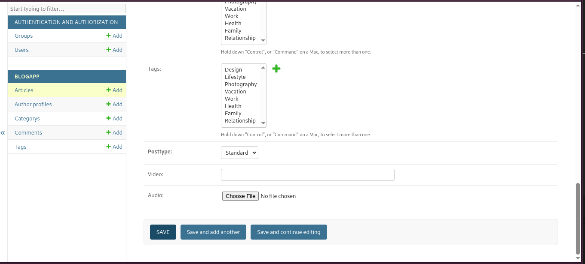


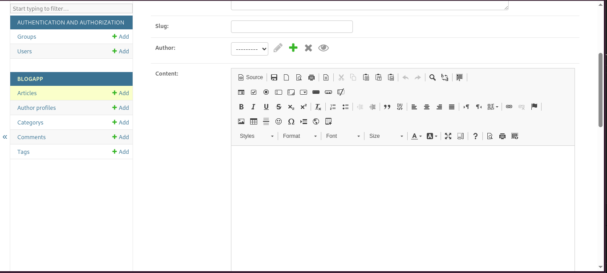


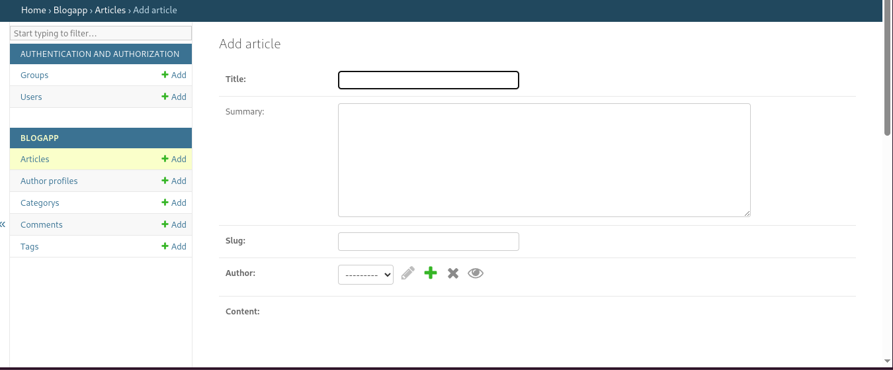


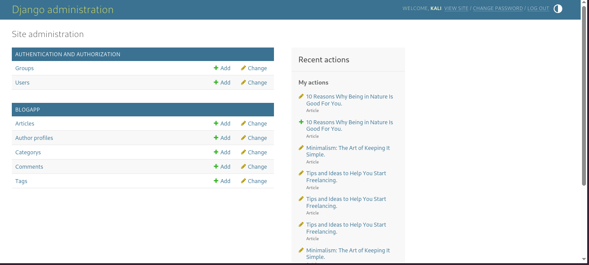


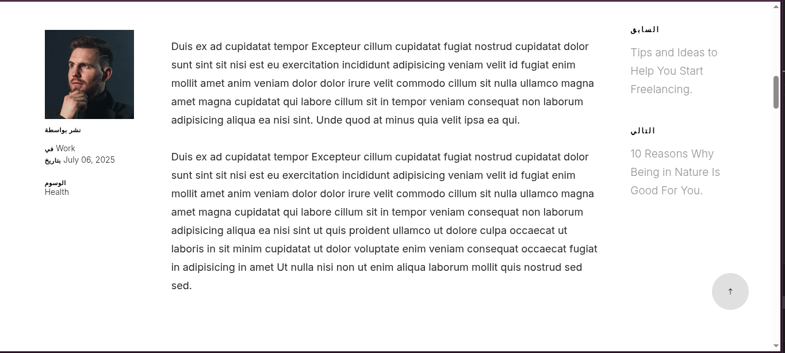


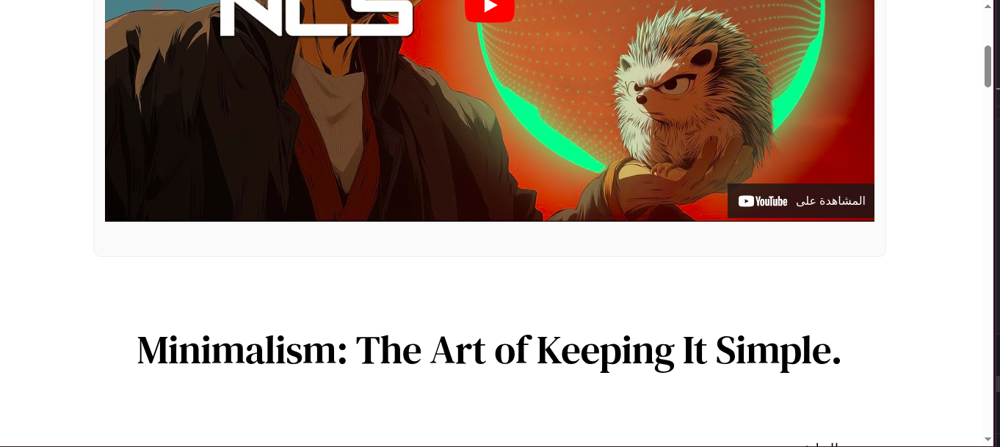


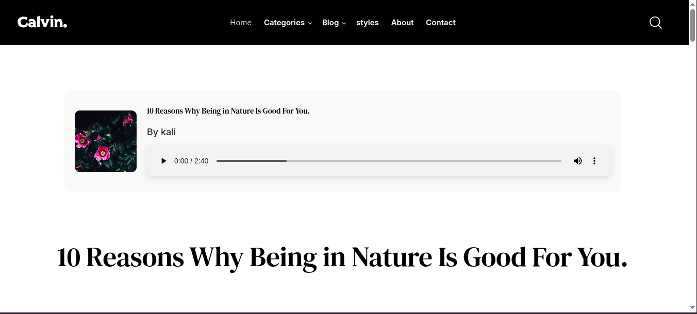


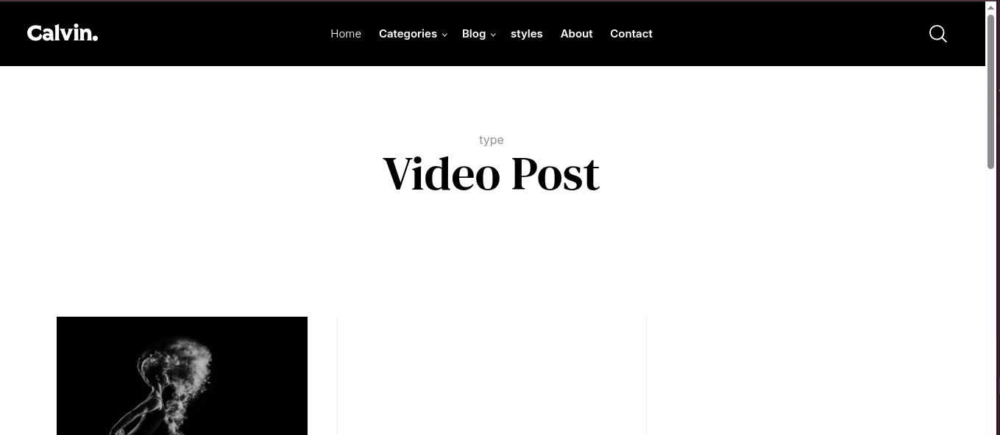


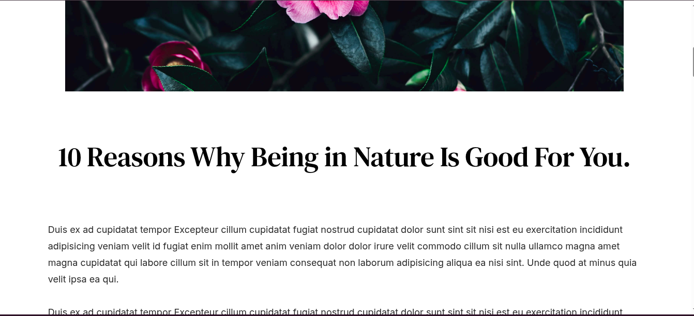


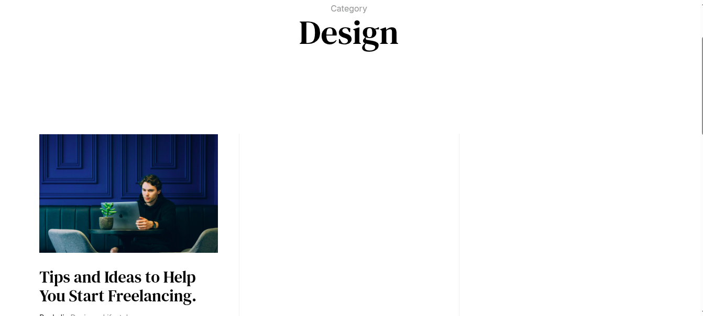


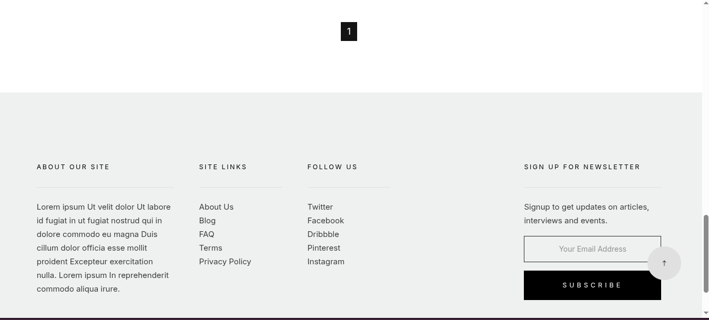


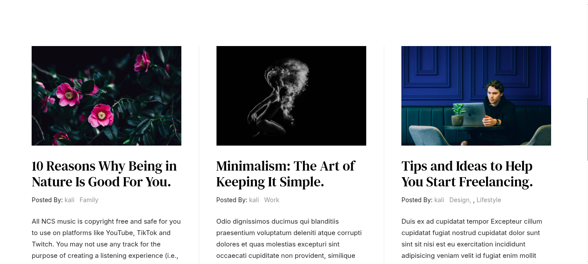


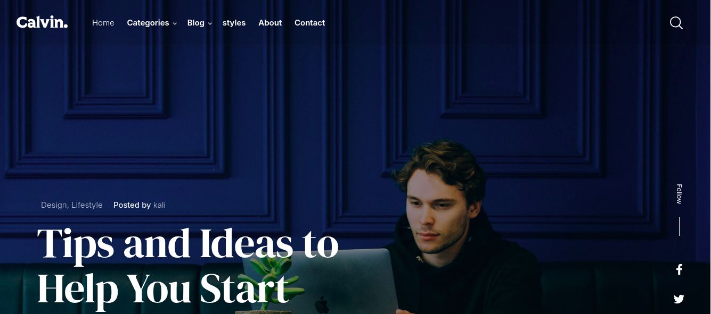


---

---

## 🇬🇧 In English

### 💡 About the Project
This is a simple personal blog built using Django and styled with a free template called **Calvin**, originally designed by StyleShout.  
The purpose of this project is for learning, experimentation, or use as a reference for web developers.


### 🧰 Technologies Used

- Python 3.x
- Django 4.x
- HTML5, CSS3, JavaScript
- Bootstrap 5
- SQLite

### ⚙ Features
- List and detail views for articles.
- Image upload support and rich text editor (CKEditor 4 — for development use only).
- Clean, modern design suitable for personal blogging.

### 🎨 Template Credit
The design is based on a modified version of the free **Calvin** template (© 2020)  
Design by: [StyleShout](https://www.styleshout.com)  
Template is used under the terms of its free license with proper credit.

### ⚠ License & Disclaimer
This code is open-source and may be freely used for **educational or personal projects**.  
❗ I take **no responsibility** for any misuse, damage, or illegal activity resulting from the use of this code.  
**Use at your own risk.**

### 🧪 How to Run (Locally)
```bash
git clone https://github.com/your-username/your-project.git
cd your-project
python -m venv env
source env/bin/activate  # or env\Scripts\activate on Windows
pip install -r requirements.txt
python manage.py migrate
python manage.py runserver
```
